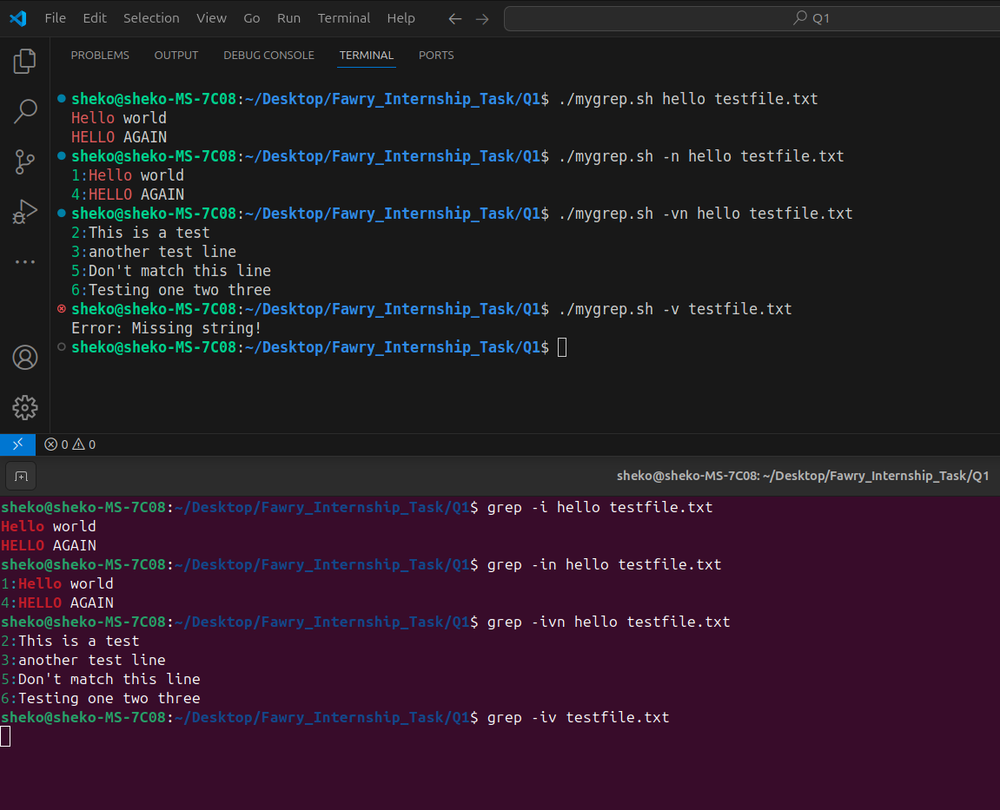

# Q1 : Custom Command (mygrep.sh)

You're asked to build a mini version of the grep command. Your script will be called `mygrep.sh` and must support:

## Basic Functionality
1. Search for a string (case-insensitive):
	- Same as `grep -i` (case-insensitive).
	- **Supports a string of multiple words.**
2. Print matching lines from a text file

## Command-Line Options:
1. `-n` → Show line numbers for each match.
2. `-v` → Invert the match (print lines that **do not** match).
3. Combinations like `-vn`, `-nv` should work the same as using `-v` `-n`.
4. **BONUS:** Improve option parsing using `getopts`.
5. **BONUS:** Add support for `--help` flag to print usage info.
  
## Technical Requirements:
1. The script **must be executable**:
	- `chmod +x mygrep.sh`
2. It must **handle** invalid input (e.g., missing file, too few arguments).
3. Output must **mimic grep's style** as closely as possible:
	- **Same output as `grep -i`.**
	- **Supports colored text.**

---
  
## Hands-On Validation:
You **must test your script** with the file `testfile.txt` containing the following:
```
Hello world
This is a test
another test line
HELLO AGAIN
Don't match this line
Testing one two three
```
Include a screenshot of your terminal running the script with:
- `./mygrep.sh hello testfile.txt`
- `./mygrep.sh -n hello testfile.txt`
- `./mygrep.sh -vn hello testfile.txt`
- `./mygrep.sh -v testfile.txt`: (expect: script should warn about missing search string)

<p align="center">
  
</p>

<p align="center">
  
</p>

---

## Reflective Section:
In your submission, include:
1. A breakdown of **how your script handles arguments and options.**
	- First: Check for '--help' flag to print usage info (BONUS)
		- Checks the first argument passed if it equals `--help`, then prints a grep-like usage info.
	- Second: Use 'getopts' for options parsing (BONUS)
		- Checks for `-n`, `-v`, `nv`, or `vn`, otherwise, prints the usage info.
	- Third: Shift options index to focus on args after the options
		- Uses the shift command with the option index variable to start the arguments from `$1`
	- Fourth: Check for missing string or file path
		- Checks if no arguments were passed, prints the usage info.
		- Checks if `$1` is the required string, and `$2` is the file path (only one argument is passed):
			- if it is a file that exists, prints a missing string error.
			- otherwise, file is not found or specified.
		- Checks if the number of arguments is more than 2, prints and error message.

2. A short paragraph: **If you were to support regex or -i/-c/-l options, how would your structure change?**
- regex: the condition of `requiredWord == currentWord` will be changed to match the passed pattern.
- `grep -i`: already implemented in this task (the idea of case-insensitive matching).
- `grep -c`: redirect the output of matched lines to `wc -l` command to count the number of matched lines.
- `grep -l`: allow searching in multiple files by executing the search function in a loop on the arguments passed after the required string. The search loop should break after finding the first instance of the required word.

3. What part of the script was hardest to implement and why?
The task would be.. if..
	- Easy: Searching for a string (case-sensitive).
	- Medium: Searching for a string (case-insensitive).
	- Hard: Searching for a multiple-words string (case-insensitive). (A feature that I liked to add to mimic grep's style)
	    -> This made the task focus on problem solving not only on bash scripting skills.

---
