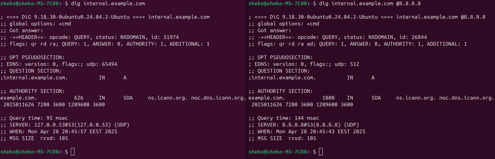
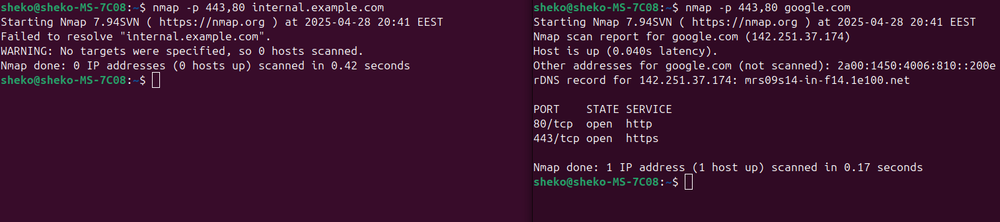

# Q2 : Scenario

Your internal web dashboard (hosted on `internal.example.com`) is suddenly unreachable from multiple systems. The service seems up, but users get "host not found" errors. You suspect a DNS or network misconfiguration. Your task is to troubleshoot, verify, and restore connectivity to the internal service.
  
**Your Task:**
1. Verify DNS Resolution:
Compare resolution from /etc/resolv.conf DNS vs. `8.8.8.8`.

2. Diagnose Service Reachability:
Confirm whether the web service (port 80 or 443) is reachable on the resolved IP.
Use `curl`, `telnet`, `netstat`, or `ss` to find if the service is listening and responding.

3. Trace the Issue – List All Possible Causes
Your goal here is to identify and list all potential reasons why [internal.example.com](http://internal.example.com/) might be unreachable, even if the service is up and running. Consider both DNS and network/service layers.

4.  Propose and Apply Fixes
For each potential issue you identified in Point 3, do the following:
    1.  Explain how you would confirm it's the actual root cause
    2.  Show the exact Linux command(s) you would use to fix it
  
**Note:** Please include screenshots that demonstrate how you identified and resolved the issue 
  
**Bonus:**
Configure a local /etc/hosts entry to bypass DNS for testing.
Show how to persist DNS server settings using systemd-resolved or NetworkManager.

---

## Solution
### Possible causes and solutions:
1. Browser cached the web page.
-> Clear browser cache and cookies or try to access the web page from a private browser window (incognito).

2. Response with a bad code.
-> Check network tab in browser's developer options (DevTools) for HTTP status code.

3. DNS misconfiguration.
-> Check if the DNS is resolved to the correct IP using `dig` command. Since it is an internal web server:
    1. Compare resolution from `/etc/resolv.conf` DNS vs. `8.8.8.8`. Try to configure the system to query the internal DNS server `/etc/resolv.conf` that knows about `internal.example.com`.
    2. (BONUS) For quick testing add an entry in `/etc/hosts` like `192.168.x.x internal.example.com` and test by executing `ping internal.example.com`.

  

4. Reachability issue.
-> Using `nmap` command, check for:
    - connectivity on specific ports (80 or 443)
    - open ports
    - firewall rules (such as Security Groups and NACLs on AWS)

  

5. Web server internal issues.
-> SSH into the web server using `ssh` command, to:
    - Open closed ports if any: `sudo ufw allow 80` or `sudo ufw allow 443`
    - View logs for errors or exceptions (e.g. `/var/log/httpd` for Apache or `/var/logs/nginx` for Nginx).
    - Check web server configuration files (e.g. `httpd.conf` or `nginx.conf`).
    - Check resources usage:
        - `top` command for CPU usage.
        - `free` command for Memory usage.
        - `df` command for disk space utilization.
