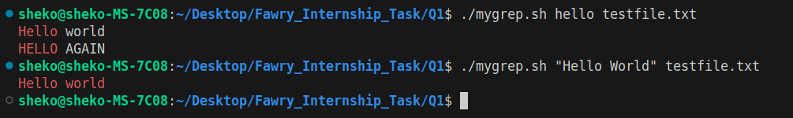

# Fawry's DevOps Internship Task

## Q1 : Custom Command (mygrep.sh)
Build a mini version of the grep command. *For more information: [Q1](Q1/README.md)*

  

---

## Q2 : Scenario
Your internal web dashboard (hosted on `internal.example.com`) is suddenly unreachable from multiple systems. The service seems up, but users get "host not found" errors. You suspect a DNS or network misconfiguration. Your task is to troubleshoot, verify, and restore connectivity to the internal service. *For more information: [Q2](Q2/README.md)*

---
